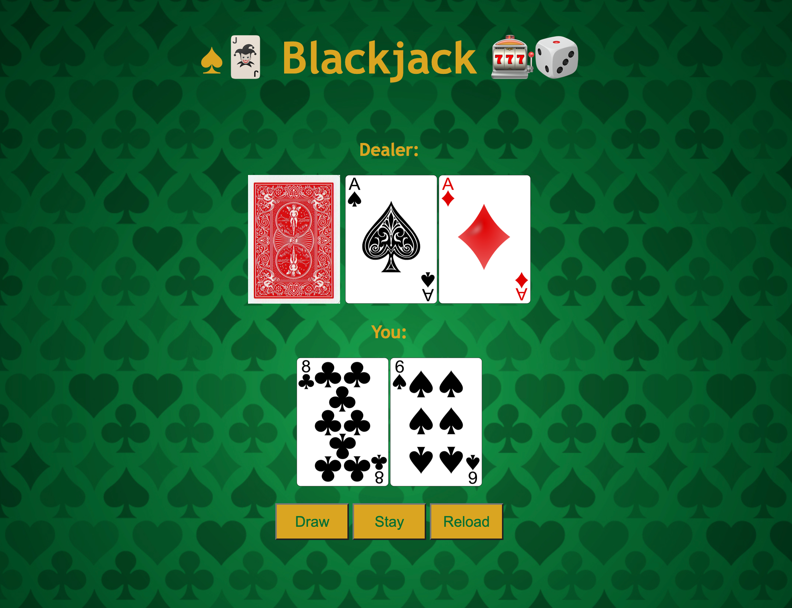

# Blackjack Card Game

## Table of contents

- [Overview](#overview)
  - [Screenshot](#screenshot)
  - [Links](#links)
- [My process](#my-process)
  - [Built with](#built-with)
  - [What I learned](#what-i-learned)
  - [Continued development](#continued-development)

## Overview

This project implements a simplified version of the classic card game Blackjack. The game is played between the player and the dealer, with the objective of getting as close to 21 points as possible without exceeding it.

### Screenshot

### Links

- Live Site URL: [https://blackjack-card-game-u6hd.onrender.com]

### Built with

- HTML
- CSS
- Javascript

## My process

### What I learned

1. JavaScript Basics: This project involves fundamental JavaScript concepts such as variables, functions, loops, conditional statements, and event handling.

2. DOM Manipulation: The code interacts with the Document Object Model (DOM) to dynamically update the HTML content based on game events and user interactions.

3. Algorithmic Thinking: The project requires implementing game logic, including card value calculation, handling Aces, determining winners, and managing game flow.
